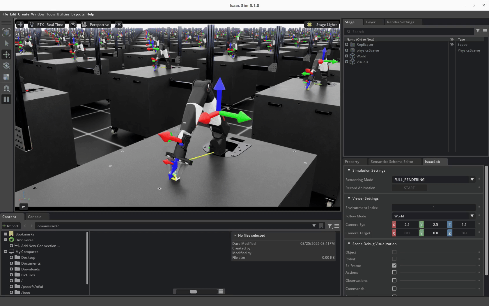
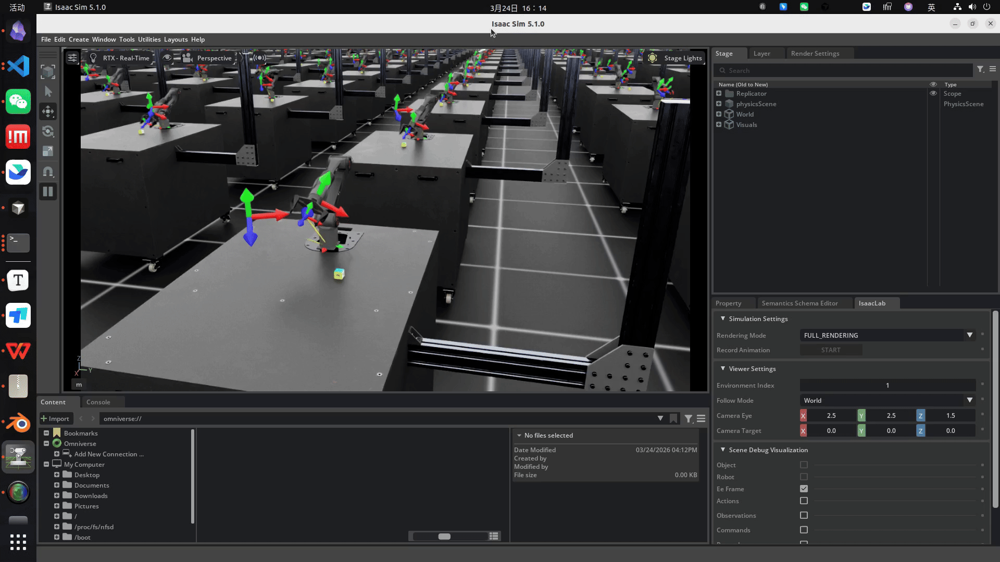

# 基于 Isaac Lab 的 Nero和Piper 强化学习案例

[](https://github.com/astral-sh/uv) [](https://docs.isaacsim.omniverse.nvidia.com/latest/index.html) [](https://isaac-sim.github.io/IsaacLab/main/index.html) [](https://docs.python.org/3/whatsnew/3.11.html)

本仓库是 [MuammerBay/isaac_so_arm101](https://github.com/MuammerBay/isaac_so_arm101) 的 Fork 版本，在原有基础上适配了nero和piper机械臂的强化学习的案例

------

## 安装

安装 `uv` 包管理工具。

```bash
curl -LsSf https://astral.sh/uv/install.sh | sh
```

克隆本仓库。

```bash
git clone https://github.com/smalleha/isaac_so_arm101.git
cd isaac_so_arm101
uv sync
```

------

## 快速开始

列出所有可用环境（包括 Nero）。

```bash
uv run list_envs
```

使用虚拟智能体测试 Nero 环境。

```bash
uv run zero_agent --task Isaac-Piper-Reach-v0     # 发送零动作
uv run random_agent --task Isaac-Piper-Reach-v0   # 发送随机动作
```

------

## 目标到达任务（Piper示例）

训练基于强化学习的逆运动学策略。

```bash
uv run train --task Isaac-Piper-Reach-v0  --headless
```

评估已训练的策略。

```bash
uv run play --task SO-ARM100-Reach-Play-v0
```

## 抓取方块到目标点（Nero示例）

使用 PPO 算法训练 Nero 策略（推荐使用无头模式以提升速度）。

```bash
uv run train --task Isaac-Nero-Reach-v0
```

也可以指定并行环境数量并显示训练过程

```bash
uv run train --task Isaac-Nero-Reach-v0 --num_envs 64
```

## 评估

回放并可视化已训练的 Nero 策略。

```bash
uv run play --task Isaac-Nero-Reach-v0
```

可选：加载指定的检查点文件。

```bash
uv run play --task Isaac-Nero-Reach-v0 --checkpoint /path/to/checkpoint.pt
```

**Nero**



**Piper**



------

## 致谢

本项目建立在以下优秀开源项目和社区的工作基础之上：

- **[Isaac Lab](https://isaac-sim.github.io/IsaacLab/)** — 本项目所基于的机器人仿真核心框架
- **[NVIDIA Isaac Sim](https://developer.nvidia.com/isaac-sim)** — 底层物理仿真平台
- **[RSL-RL](https://github.com/leggedrobotics/rsl_rl)** — 用于训练策略的强化学习库
- **[MuammerBay/isaac_so_arm101](https://github.com/MuammerBay/isaac_so_arm101)** — 本 Fork 所基于的上游仓库

------

## 引用

如果您在研究中使用了本项目，请引用上游项目：

```bibtex
@software{Louis_Isaac_Lab_2025,
   author = {Louis, Le Lay and Muammer, Bay},
   doi = {https://doi.org/10.5281/zenodo.16794229},
   license = {BSD-3-Clause},
   month = apr,
   title = {Isaac Lab – SO‑ARM100 / SO‑ARM101 Project},
   url = {https://github.com/MuammerBay/isaac_so_arm101},
   version = {1.1.0},
   year = {2025}
}
```

------

## 许可证

详情请参阅 [LICENSE](https://claude.ai/chat/LICENSE)。